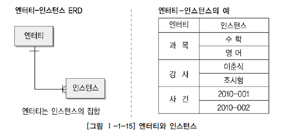
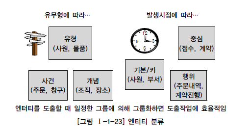

# ENTITY
2022-10-18 21:39
### TAG  : #db
---
# entity란?
- 우리말로 **객체, 실체**
- 사람,장소,물건 등의 **명사**
- 어떤 것 **(Thing)** 
- 인스턴스의 집합 (row)

`업무에 필요하고, 유용한 정보를 저장하기 위한 집합적인 것`

---
# 표기법

---
# entitiy의 특징
아래의 성질을 만족하지 못하면, 적절하지 않을 확률이 높음
- 반드시 해당 업무에서 필요한 정보어야 함
- 유일한 식별자에 의해 식별이 가능해야 함
- 반드시 2개 이상의 인스턴스의 집합이어야 함
- 반드시 속성이 존재해야함
- 최소 다른 entitiy와 한 개 이상의 관계가 있어야 함

---
# entity의 분류
### 유형에 따른 분류
- 유형엔티티 
	물리적인 형태, 안정적, 지속적으로 활용
	ex) 사원, 물품, 강사

- 개념엔티티
	물리적이지 않고 개념만 구분되는 엔티티
	ex)조직, 보험상품

- 사건 엔티티
	업무를 수행함에 따라 발생되는 엔티티
	ex)주문, 청구

발생에 따른 분류
- 기본엔티티
	원래 존재하는 정보로서, 독립적으로 생성되고, 부모역활
	주식별자를 상속받지 않고 자신만의 고유한 주식별자를 가짐

- 중심엔티티
	기본엔티티로부터 발생되고, 그 업무에 있어서 중심적인 역활
	다른 엔티티와의 관계를 통해 많은 행위엔티티 생성

- 행위엔티티
	두 개 이상의 부모엔티티로부터 발생되고, 자주 변경이 있음
	ex) 주문목록, 사원변경이력
---
# 엔티티 분류 방법의 예

이 외에도 스스로 생성될 수 있는지 여부에따라 독립/의존 구분 가능

---
명명
1. 현업에서 사용하는 용어를 사용
2. 약어사용 지양
3. 단수명사 사용
4. 유일한 이름을 가짐
5. 생성의미의 이름을 가짐
---
참고한 곳
[DATA ON-AIR](https://dataonair.or.kr/db-tech-reference/d-guide/sql/?pageid=5&mod=d%E2%89%88ocument&uid=326)
